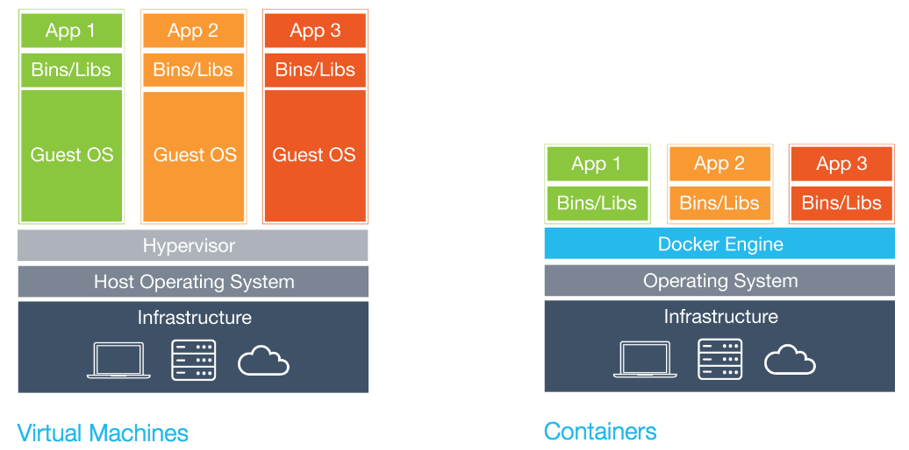

# TIPS
## Vagrant
Vagrantというものを聞いたことはありますか?

[](https://www.vagrantup.com/)

まぁ簡単にいえば仮想マシンをもっと簡潔に構築することができるツールです.
例えば仮想マシン環境を構築したい場合, 各OS毎に毎回インストールをして, ... という作業は面倒くさいものです.そこでそこら辺の作業を全部コマンド経由で勝手にやってくれたらいいよね.というようなツールです.

各自以下のページでダウンロードしてインストールしてみましょう.

* [Vagrant Downloads](https://www.vagrantup.com/downloads.html)

次にシェルを開き, `vagrant -h`とか打ってみます.これでコマンドが出てくればOKです.

では使ってみます.
適当にホームディレクトリ上に`vagrant`というようなディレクトリを作成し, 更に`ubuntu1604`と言った名前のディレクトリを作ります.

そうしたら,

```bash
$ vagrant init ubuntu/xenial64; vagrant up --provider virtualbox
$ vagrant ssh
```

で仮想マシン上にログインできます.

どうでしょうか? ダウンロードも含めると10分もしないでUbuntuの仮想マシンができました.

また, `/vagrant` にホストマシンの先ほど作成したディレクトリがマウントされるのでホスト, 仮想間のファイルやり取りも簡単にできます.
またデフォルトではネットワーク構成はNATでメモリ量も決まっていますが`Vagrantfile`をいじればそのへんの設定も変えることができます.

また以下のように多くのディストリビューションが公開されていて, すぐに仮想マシンを作れます

* [Ubuntu](https://atlas.hashicorp.com/ubuntu)
* [CentOS](https://atlas.hashicorp.com/centos)
* [FreeBSD](https://atlas.hashicorp.com/freebsd)
* [Debian](https://atlas.hashicorp.com/debian)

これで楽々仮想マシンライフを楽しんでみてはw

## Docker


Dockerは仮想化技術の1つでコンテナと呼ばれるものを扱うソフトウェアらしいw

正直使ってみると楽な感じがわかると思うので, 以下実演してみる.
(実演 2分程度?)

### Dockerと仮想マシンの違い
Dockerと仮想マシンについての違い, 特徴については,

* [今からでも間に合うDockerの基礎。コンテナとは何か、Dockerfileとは何か。Docker Meetup Tokyo #2](http://www.publickey1.jp/blog/14/dockerdockerfiledocker_meetup_tokyo_2.html)

に詳しく書かれています.


(画像は[Docker公式のページ](https://www.docker.com/what-docker)より)

左のVMではゲストOSを用意し,アプリケーションをデプロイするため,多くの容量を必要としましたが, コンテナはハイレベルから見ればプロセスが隔離され,メモリも食わず,ネットワークも独自に振られていて, root権限も扱える軽量なVMに見えます.
低いレベルから見れば,1つのコンテナで1プロセスであり, カーネルをホストと共有し,エミュレーションがないためオーバーヘッドが少なく,cgroupsを用いればリソース制限もできるというものになります.

さらに`Dockerfile`というものを書くことでインフラをコード化することができ,楽だね.ということです.

### Dockerのインストール
Dockerをインストールしましょう.以下の方法はMacを前提に書いています.その他のOSを利用している方は

* [Install Dockee Engine](https://docs.docker.com/engine/installation/)

の各ディストリビューション毎の設定を見てください.
Windowsにおいてはバイナリファイルが配布されているのでそれを利用すれば使うことができます.

さて, Macにおいては前提となるLinuxカーネルが存在しません.そこで`boot2docker`と呼ばれる簡易なLinuxをVirtualBoxにインストールします.

まず, HomebrewでDockerをまとめてインストールしましょう.

```bash
$ brew install docker docker-machine docker-compose
```

そうしたら先ほど行ったようにVMを作成します.

```bash
$ docker-machine create -d virtualbox default
(仮想マシンが生まれる)
$ docker-machine ls # docker-machineの一覧
```

さて, ここまで来たらDocker環境が整いました.よくやるhello, worldを動かしてみましょう.

```bash
$ docker run hello-world
Unable to find image 'hello-world:latest' locally
latest: Pulling from library/hello-world
a9d36faac0fe: Pull complete
Digest: sha256:e52be8ffeeb1f374f440893189cd32f44cb166650e7ab185fa7735b7dc48d619
Status: Downloaded newer image for hello-world:latest

Hello from Docker.
This message shows that your installation appears to be working correctly.

To generate this message, Docker took the following steps:
1. The Docker client contacted the Docker daemon.
2. The Docker daemon pulled the "hello-world" image from the Docker Hub.
3. The Docker daemon created a new container from that image which runs the
   executable that produces the output you are currently reading.
4. The Docker daemon streamed that output to the Docker client, which sent it
   to your terminal.

To try something more ambitious, you can run an Ubuntu container with:
$ docker run -it ubuntu bash

Share images, automate workflows, and more with a free Docker Hub account:
https://hub.docker.com

For more examples and ideas, visit:
https://docs.docker.com/engine/userguide/
```

ついでにUbuntuも動かしてみましょうか.

```bash
$ docker run -it ubuntu:14.04
root@0c4640ba971c:/# lsb_release -a
No LSB modules are available.
Distributor ID: Ubuntu
Description:    Ubuntu 14.04.4 LTS
Release:        14.04
Codename:       trusty
```

実演したようにここでWordpressのDockerコンテナをデプロイして実行してみましょう.

```bash
$ docker run --name wordpress --link wordpress-mysql:mysql -d wordpress
7ed3b40cc734827f251f8ad66ac8676fb5444f429aa4ea3b5e222a7abf96cb67
$ docker run -d --name wordpress --link wordpress-mysql:mysql -p 8080:80 wordpress
b205f06d5d75b91834f626473d50d1038eadda350586eb4506ceee948a75be65
$ docker ps
CONTAINER ID        IMAGE               COMMAND                  CREATED              STATUS              PORTS                  NAMES
b205f06d5d75        wordpress           "/entrypoint.sh apach"   37 seconds ago       Up 35 seconds       0.0.0.0:8080->80/tcp   wordpress
297cc134f17d        mysql:5.6           "docker-entrypoint.sh"   About a minute ago   Up About a minute   3306/tcp               wordpress-mysql
```

こんな感じで簡単に少量のメモリやリソースで各環境を作ることができるため, 非常に便利ですね.

### Dockerコマンドリファレンス
まず, コンテナイメージを入手します.これは

```bash
$ docker pull ubuntu:14.04  # Ubuntuのtag 14.04を落としてくる
```

でできます.次にコンテナを起動してみます.

```bash
$ docker run ubuntu:14.04 lsb_release -a
No LSB modules are available.
Distributor ID: Ubuntu
Description:    Ubuntu 14.04.4 LTS
Release:        14.04
Codename:       trusty
```

Dockerの面白いことにプロセスの実行が終わったらすぐにコンテナが終了します.
そこでコンテナの一覧を見てみましょう.

```bash
$ docker ps -a # すべてを表示
CONTAINER ID        IMAGE               COMMAND             CREATED              STATUS                          PORTS               NAMES
33445bfd9cda        ubuntu:14.04        "lsb_release -a"    About a minute ago   Exited (0) About a minute ago                       cranky_euclid
```

またコンテナを起動したいときは,

```bash
$ docker start 33445  # 起動したいコンテナのIDを入力する
33445
$ docker ps -a
CONTAINER ID        IMAGE               COMMAND             CREATED             STATUS                     PORTS               NAMES
33445bfd9cda        ubuntu:14.04        "lsb_release -a"    2 minutes ago       Exited (0) 2 seconds ago                       cranky_euclid
```

こんな感じで実行したらすぐさまコンテナが終了します.
コンテナを消したい場合はrmコマンドで消せます.

```bash
$ docker rm 33445
33445
docker ps -a
CONTAINER ID        IMAGE               COMMAND             CREATED             STATUS              PORTS               NAMES
```

例えばNginxといったWebサーバーなどを使いたいときは後ろでデーモン化させずっと起動させておくことでコンテナを維持できます.(あとrun時に-dオプションを付けます)

実際にやってみましょう.

```bash
$ docker run --name nginx  -d -p 8080:80 nginx
Unable to find image 'nginx:latest' locally
latest: Pulling from library/nginx

51f5c6a04d83: Already exists
a3ed95caeb02: Pull complete
51d229e136d0: Pull complete
bcd41daec8cc: Pull complete
Digest: sha256:0fe6413f3e30fcc5920bc8fa769280975b10b1c26721de956e1428b9e2f29d04
Status: Downloaded newer image for nginx:latest
620a8758db606e2900803c185142b416ee3612fd1b9da25f4cdc08c8707fd11c
$ docker ps
CONTAINER ID        IMAGE               COMMAND                  CREATED             STATUS              PORTS                           NAMES
620a8758db60        nginx               "nginx -g 'daemon off"   27 seconds ago      Up 26 seconds       443/tcp, 0.0.0.0:8080->80/tcp   nginx
```

コマンドの意味としては`-d`でデーモン化, `-p`でポートフォワーディング, `--name`で名前をつけることによってこの名前でコンテナにアクセスできます.

私の環境では`http://localhost:8080`でお馴染みのWelcome to nginxが表示されましたが`docker-machine`を使っている場合は`docker-machine ip`に表示されたIPアドレスを使ってアクセスしてください.

またコンテナが起動している時にコンテナ内に入ってシェルを起動したいというようなときがあります.こんなときは`docker attach`や`docker start`などをしても無駄で以下のコマンドで行うことができます.

```bash
$ docker exec nginx /bin/bash
root@620a8758db60:/# ps aux
USER       PID %CPU %MEM    VSZ   RSS TTY      STAT START   TIME COMMAND
root         1  0.0  0.2  31688  4808 ?        Ss   15:49   0:00 nginx: master process nginx -g daemon off;
nginx        6  0.0  0.1  32080  2940 ?        S    15:49   0:00 nginx: worker process
root         7  0.2  0.1  20040  2716 ?        Ss   15:53   0:00 /bin/bash
root        19  0.5  0.1  20224  3036 ?        Ss   15:53   0:00 /bin/bash
root        24  0.0  0.1  17500  2056 ?        R+   15:54   0:00 ps aux
```

また`exec`はそれで実行したプロセスを終了させても元のコンテナが終了することはありません.

上記の様に永久的に動いているコンテナを止めるためには`stop`を用います.

```bash
$ docker stop nginx
nginx
$ docker ps -a
CONTAINER ID        IMAGE               COMMAND                  CREATED             STATUS                     PORTS               NAMES
620a8758db60        nginx               "nginx -g 'daemon off"   5 minutes ago       Exited (0) 3 seconds ago                       nginx
```

ダウンロードしたコンテナイメージの一覧は`docker images`で見ることができ, それらの削除は`docker rmi`コマンドで行います.先ほどダウンロードしてきた`nginx`のイメージを消してみます.

```bash
$ docker images
REPOSITORY          TAG                 IMAGE ID            CREATED             SIZE
nginx               latest              0d409d33b27e        8 days ago          182.8 MB
$ docker rmi nginx
Untagged: nginx:latest
Deleted: sha256:0d409d33b27e47423b049f7f863faa08655a8c901749c2b25b93ca67d01a470d
Deleted: sha256:894e1c82ec1396d0d30c0f710d0df5ae5f8dc543e53cca3f92d305fe09370282
Deleted: sha256:26fdf3d8f16c52bcf3c6b363739bda3c9531e394427d09d7118446914eedae02
Deleted: sha256:2254f56d1c260b47ea426e484164f7ef161310ef7d8a089d3a2f86a31fcd575f
Deleted: sha256:f75463f4fa42454f52336dcab2c98ed51c3466db347c2bc4e210d708645e77f2
Deleted: sha256:8a12ca546a1bd35ad5d1521645c95bf731bf86ccec2131f5499d1fcdfd5f8d43
Deleted: sha256:0c01e4298c8c6e3d7452f2a3e61addc98ac96242b0d679ae22ec02dc6961e0d7
$ docker images
REPOSITORY          TAG                 IMAGE ID            CREATED             SIZE
```

最後に自分でコンテナイメージを作成したい場合があると思います.
そんなときはDockerfileというものを書き, `docker build`をすることで自分だけのイメージを手に入れることができます.

Dockerfileの書き方については以下を参考にしてみると良いでしょう.

* [Dockerfile Reference](https://docs.docker.com/engine/reference/builder/)

#### docker-machine コマンドリファレンス
WindowsやMacがホストマシンのユーザーは基本的に`docker-machine`を使います.
最初に述べたように`docker-machine`で使う仮想マシンを作成します.

```bash
$ docker-machine create -d virtualbox default
Running pre-create checks...
(default) No default Boot2Docker ISO found locally, downloading the latest release...
(default) Latest release for github.com/boot2docker/boot2docker is v1.11.2
(default) Downloading /Users/jtwp470/.docker/machine/cache/boot2docker.iso from https://github.com/boot2docker/boot2docker/releases/download/v1.11.2/boot2docker.iso...
(default) 0%....10%....20%....30%....40%....50%....60%....70%....80%....90%....100%
Creating machine...
(default) Copying /Users/jtwp470/.docker/machine/cache/boot2docker.iso to /Users/jtwp470/.docker/machine/machines/default/boot2docker.iso...
(default) Creating VirtualBox VM...
(default) Creating SSH key...
(default) Starting the VM...
(default) Check network to re-create if needed...
(default) Found a new host-only adapter: "vboxnet0"
(default) Waiting for an IP...
Waiting for machine to be running, this may take a few minutes...
Detecting operating system of created instance...
Waiting for SSH to be available...
Detecting the provisioner...
Provisioning with boot2docker...
Copying certs to the local machine directory...
Copying certs to the remote machine...
Setting Docker configuration on the remote daemon...
Checking connection to Docker...
Docker is up and running!
To see how to connect your Docker Client to the Docker Engine running on this virtual machine, run: docker-machine env default
```

ちなみにですが`-d`以下ではVirtualBox以外にもAWSやAzure, GCPや自前のLinuxサーバーなどを指定することもできます.

うまいことできたら, `docker-machine env default`とうち,

```bash
$ eval $(docker-machine env default)
```

で環境変数を認識させます.
`docker-machine`の一覧は`ls`コマンドで, `docker-machine`を止めるには`docker-machine stop`でできます.

こんな感じで一度`docker-machine`を作成したら`docker-machine start default`で仮想マシンを起動し, `eval ~ `で環境変数を認識させ使い終わったら, `docker-machine stop default`で仮想マシンを停止させるようにしましょう.

その他のドキュメントに関しては[公式ドキュメント](https://docs.docker.com/machine/)を読みましょう.

### docker-composeで複数のDockerコンテナを組み合わせる
`docker-compose`を使うと複数のコンテナを束ねて使うことができます.
なので, Wordpressを使いたいときは, 普通PHPインストール済みのWordpressとApache, そしてMySQLのコンテナを組み合わせたりします.

* [wordpress - Docker Hub](https://hub.docker.com/_/wordpress/)

まず, [`docker-compose.yml`](confs/tips/docker-compose.yml)を書く.

```
wordpress:
  image: wordpress
  links:
    - db:mysql
  ports:
    - 8080:80

db:
  image: mysql:5.6
  environment:
    MYSQL_ROOT_PASSWORD: password
```

そうして`docker-compose.yml`のあるディレクトリに行き,

```bash
$ docker-compose up
...
```

あとは適当なブラウザで`http://localhost:8080`などを開けばWordPressが動いていることを確認できます.

なので簡単に複数のコンテナを組み合わせながら環境を構築することが可能です.

## Ansible
(書きたかったw)
